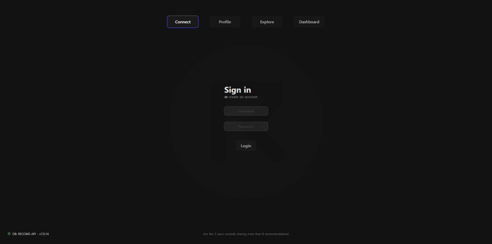
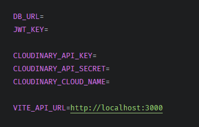
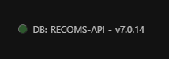
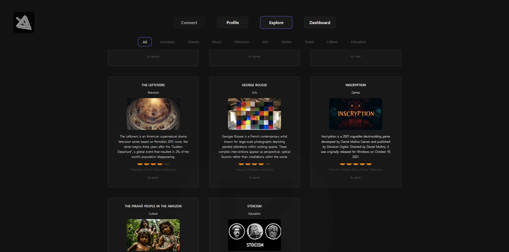
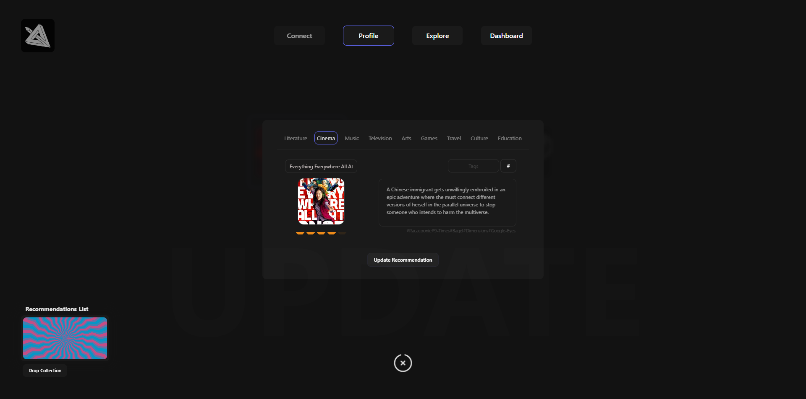
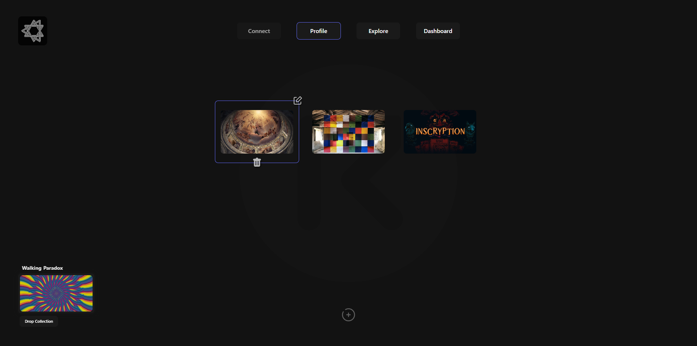
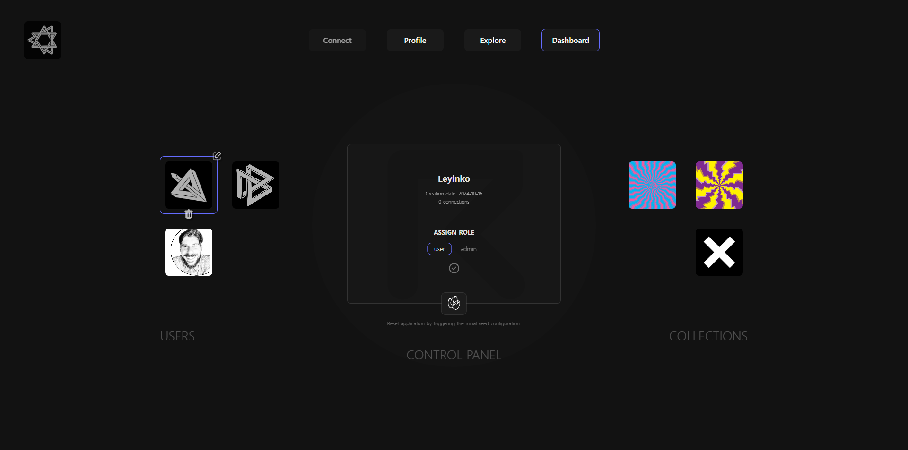
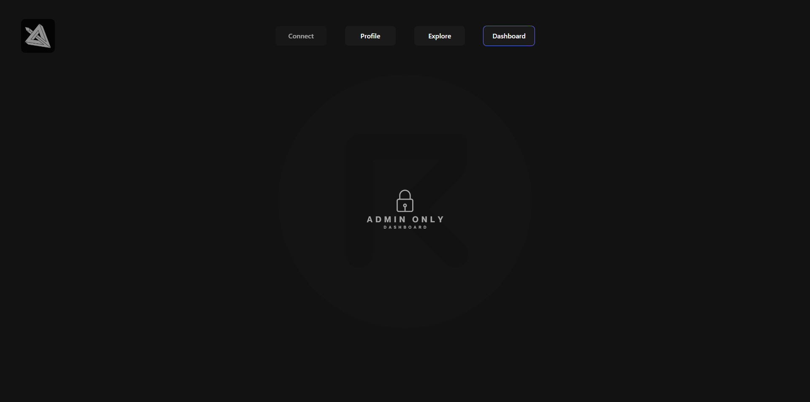

# Recoms-API

 

Recoms-API is a simple application that enables users to create customizable collections of item recommendations. Users can build personal collections, update or delete items, and store them in a centralized database. These collections can either be used for personal storage or shared with other users on the platform. The database supports user accounts and multiple collections, with features for categorization and content management.
 
 

## Features

- Built with the Vite-Express package, integrating both the front-end and server-side.
- Backend implemented with Express.js and database management using MongoDB.
- Centralized database, structured into partitions for users, collections, and recommendations.
- Includes authentication, token-based authorization, role-based access control, and secure session management.
- Advanced bulk data seeding via script commands, or with special Reset admin-only process accessible through the frontend.
- Cloudinary image storage and management with logic and folder organization for updating, deleting images to maintain synchronized storage on every action on the database.
- App accessible throught the deployment link, or run locally by cloning the repository and setting up a custom .env configuration for a detailed experience.
- Log window displays messages for database updates and system notifications.
   
   

## Setting up

First, configure the `.env` file to match your environment settings:

1- Set the MongoDB URL.  
2- Define a JSON Web Token (JWT) key for token generation.  
3- Add your Cloudinary API credentials for image management.  
4- Set the VITE_API_URL. 
 
Ensure that the `VITE_API_URL` points to your local launch point and API base route.
Correct configuration is essential for proper API fetching.

The application includes an AppStats signal on the home login page, which retrieves your database name and other details.
Make sure to name your MongoDB cluster in the URL, as MongoDB will default to 'test' if the name is not set.

The database name should be placed between `mongodb.net/` and the `?` in the URL, like so:
`DB_URL=mongodb+srv://<user>:<password>@recoms-api.quack.mongodb.net/NAME?`

## Seeding Data to Start

Run the `npm run seed All` command in the console to populate the database and explore the app’s features.
The Admin dashboard includes a button to trigger the seeding script directly from the interface for easier setup or resets.

You can also customize your seed data to bulk load only Users, Collections, or Recommendations, depending on your needs.
Check the `seeds.js` file for details.
 
 

## Launch and Explore

You can use Recoms-API officially via [Recoms-API](https://recoms-api.onrender.com/login) on Render or install it locally with [Node.js](https://nodejs.org/) v10+ to run.
Render has a policy for free instance that will spin down for inactivity, which can delay requests by 50 seconds or more - Be patient on first loading!

## Techs

## Screenshots

