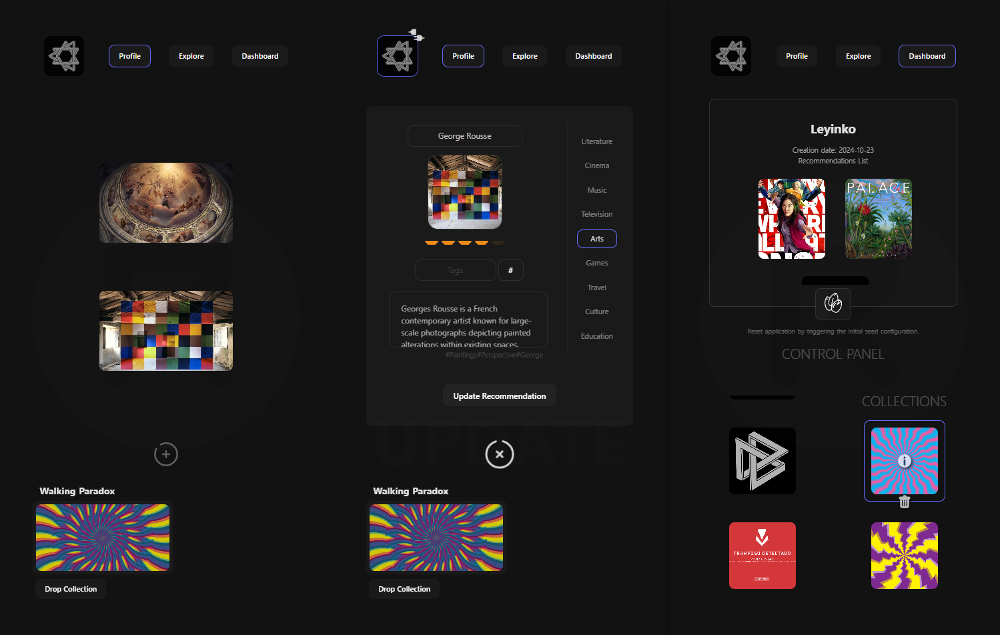

# Recoms-API


<br>

Recoms-API is a simple application that enables users to create customizable collections of item recommendations. Users can build personal collections, update or delete items, and store them in a centralized database. These collections can either be used for personal storage or shared with other users on the platform.
<br>

### Features

- Built with the Vite-Express package, integrating both the front-end and server-side.
- Backend implemented with Express.js and database management using MongoDB.
- Centralized database, structured into partitions for users, collections, and recommendations.
- Includes authentication, token-based authorization, role-based access control, and secure session management.
- Advanced bulk data seeding via script commands.
- Advanced Cloudinary image storage and management.
- Both Development and Production modes to explore the application.
  <br>
  <br>

## Setting up

First, clone the repository in a local folder.<Br>
Launch the build command to create the `/dist` folder with the `npm run build`.

Create and configure a `.env` file to match the environment settings.

#### Follow the image below:


1- Set the MongoDB URL. <br>
2- Define a customized string for token generation.<br>
3- Add your Cloudinary API credentials for images management. <br>
4- Set your base URL.<br>
<br>
Ensure that the `VITE_API_URL` points to your local launch point and API base route.
Correct configuration is essential for proper API fetching.

##### Optional

The application includes an initial signal on the home login page, which retrieves your database name and some others details.
Make sure to name your MongoDB cluster in the URL, as MongoDB will default to `test` if the name is not set.

The database name should be placed between `mongodb.net/` and the `?` in the URL, like so:

```
DB_URL=mongodb+srv://<user>:<password>@recoms-api.quack.mongodb.net/NAME-HERE?
```

### Seeding Data or Register to Start

Run the `npm run seed All` command in the console to populate the database and fully explore the App’s features or create a new account ont the Connect page to get started.

Check the `seeds.js` file for some customize bulk load details.
<br>
<br>

## Launch and Explore

Use Recoms-API officially via [Recoms-API](https://recoms-api.onrender.com/login) on Render or locally with [Node.js](https://nodejs.org/) as Development mode with `npm run dev` or as a Production simulation deployment with `npm run start` commands.

Keep in mind that Render has a policy for free instance that will spin down for inactivity, which can delay requests by 50 seconds or more - Be patient on first loading!
<br>
<br>

<div style="display:flex">


</div>
<br>
<br>

## Screenshots



